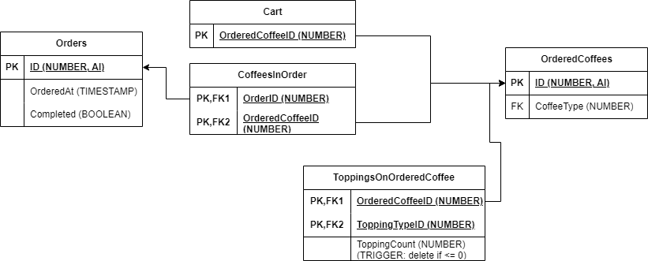

# Rendszerterv
## 1. A rendszer célja

Az alkalmazás célja egy kávézó szoftveralkalmazás létrehozása. A felhasználó képes több kávétípus közül választani. Az elkészített kávék egy adatbázisban lesznek eltárolva. Az adatábázisban tároljuk a felhasználók által leadott rendeléseket is.

## 2. Projektterv

A projektet Java programnyelven fejlesztjük, bizonyos tervezési minták felhasználásával, a követelményeknek megfelelően.

## 3. Folyamatok modellje

## 4. Követelmények

### Funkcionális követelmények

- Kávék elkészítése
- Kávék mentése adatbázisba
- Feltét hozzáadása
- Rendelések mentése adatbázisba
 
### Nemfunkcionális követelmények

- Java nyelv használata fejlesztéshez
- Az alkalmazás adatbázishoz kapcsolódik
- Tervezési minták használata

### 5. Fejlesztő eszközök

A fejlesztés során használt eszközök:
- Visul Studio Code
- IntelliJ Idea Community Edition
- Xampp
- Mysql

## 6. Architekturális terv

### Adatbázis rendszer

A szoftver MySQL-alapú adatbázis szervert használ.

### A program elérése, kezelése

A programnak el kell tudni érnie az adatbázis-szervert, továbbá rendelkeznie kell Java futtatókörnyezettel.

## 7. Adatbázis terv

## 8. Implementációs terv

A szoftver fejlesztéséhez Java programozási nyelvet használunk, a frontend kialakítását Swing-gel, az adatbázis kialakítását pedig MySQL-rendszerrel oldjuk meg. Ügyelni kell a logolásra, illetve az OCP és SRP szabályainak betartására. Terv szerint a **dekorátor**, **stratégia** és **sablonmetódus** tervezési mintákat használjuk fel.

## 9. Tesztterv

A program tesztelése elsősorban unit tesztek segítségével történik, a manuális tesztelése kívül, JUnit segítségével.

## 10. Telepítési terv

Az alkalmazás önmagában nem igényel telepítést, viszont szükséges hozzá valamilyen Java futtatókörnyezet telepítése, ennek a telepítésének a menete az operációs rendszertől függ, ez megtalálható a Java dokumentációban.

## 11. Karbantartási terv

A Java-keretrendszert három havonta frissíteni kell, és javítani kell azokat a részeket, amelyek az új verzió során elavultakká váltak. Figyelni kell a felhasználók által jelzett szoftverhibákra, és súlyosság szerint kell prioritásba venni őket (hotfixek kritikus hibák javítására, havi frissítések kisebbekre). Választék bővítése esetén bővítendő a szoftver is.